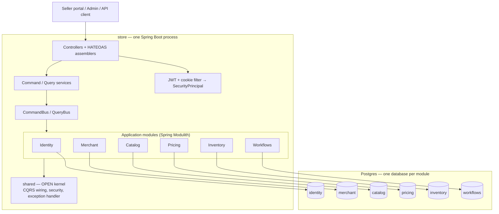
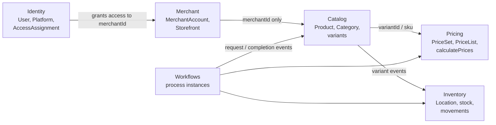
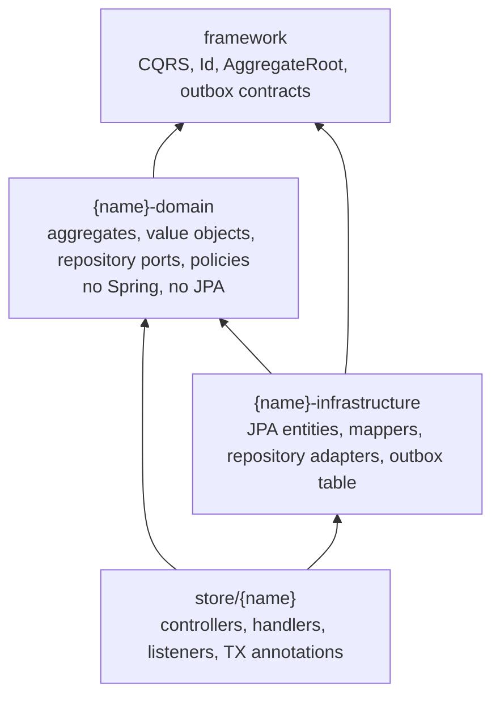
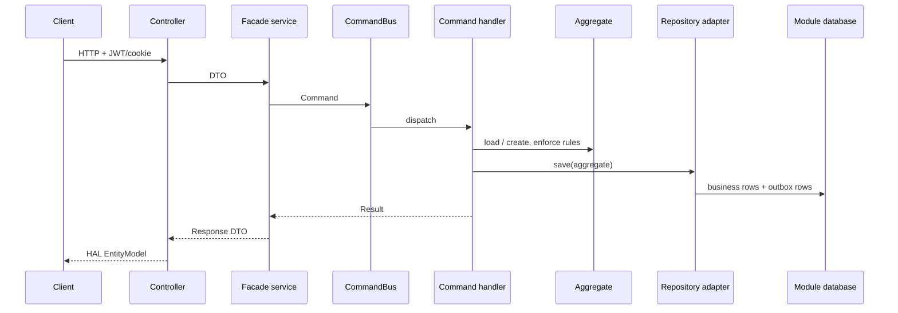

# 1. System architecture

This application is a **modular monolith**: one Spring Boot process that you
run as `store`, with several **bounded contexts** that own their own models and
databases.

That is the current system, not a future microservice map. The module
boundaries exist so a context *could* be extracted later without rewriting the
domain.

## Picture

`store` is the **composition root**. It imports infrastructure, exposes HTTP,
wires the buses, and binds each module to its datasource. Domain jars do not
start a server.

## Bounded contexts and what they own

Modules talk by **ID** and by **events**. They do not share aggregates or join
across databases.

| Context | Owns | Does **not** own |
| --- | --- | --- |
| Identity | Users, credentials, sessions, platforms, roles, access grants | The seller business, products, stock |
| Merchant | Merchant account lifecycle, storefront | Login, listings, warehouses |
| Catalog | Product content, variants, categories | Price amounts, on-hand quantity |
| Pricing | Price sets, campaigns, contextual calculation | Product names, stock |
| Inventory | Locations / zones / bins, stock, movements | Product copy, selling price |
| Workflows | Checkpoints and step order for multi-module writes | Domain invariants of the other contexts |

A person who logs in is a **User**. A business they sell under is a
**MerchantAccount**. A warehouse is an Inventory **Location**. Mixing those
three into one “seller” table is the design this repo refuses.

## Three jars per business context

Dependency direction is inward: domain does not know HTTP or Hibernate.
Infrastructure implements ports. `store` orchestrates use cases.

Spring Modulith enforces the same idea **inside** `store`:

- `internal/` is private to that module.
- Other modules may only import named interfaces such as `catalog::events` or
  `catalog::api`.
- `shared` is `OPEN` so every module can use security and CQRS wiring.

Example: Catalog may depend on `workflows::events`. Inventory may depend on
`catalog::events` and `catalog::api`. Merchant depends only on `shared`.
Identity may depend on `merchant::events` so it can grant access when a
merchant is approved.

## How a typical request is composed

This is the same path you will see in the CQRS and persistence chapters.

Writes go through the aggregate. Reads usually skip the aggregate and use a
query repository or projection. That split is [CQRS](02-cqrs.md).

## Why a modular monolith, not microservices

| Option | Why it was not chosen now |
| --- | --- |
| **One MVC app, one database, shared entities** | Fast to start, but Catalog would grow foreign keys into Inventory and Identity. Extraction later means rewriting the model. |
| **Microservices from day one** | Each BC would need its own deploy, auth, and ops story before the domain is stable. You would still need the same boundaries — plus network failure. |
| **Modular monolith (accepted)** | One process to run locally and in Docker. Separate datasources and Modulith checks keep the boundaries real. Outbox and workflow ports are already shaped for a later broker. |

The extra cost you **do** pay: more Spring wiring, explicit transaction
annotations, and no cross-module JPA joins. That cost is intentional.

## Why hexagonal slices, not “package by layer” only

A global `controller / service / repository` layout still lets any service
import any entity. Splitting **by bounded context first**, then by layer,
keeps language and persistence with the business that owns them.

`framework` is a **shared kernel**, not a dumping ground: CQRS buses, `Id`,
`AggregateRoot`, outbox contracts, workflow types, logging SPI. Business rules
do not live there.

## Where to look in code

| Piece | Location |
| --- | --- |
| Spring Boot entry | `store/.../EcommerceApplication.java` |
| Modulith markers | `store/.../catalog/CatalogModule.java` (and siblings) |
| Open shared module | `store/.../shared/package-info.java` |
| Named event packages | `store/.../catalog/events`, `merchant/events`, `workflows/events` |
| Domain example | `catalog-domain/.../aggregate/Product.java` |
| Infra example | `catalog-infrastructure/.../repository/jpa/impl/ProductRepositoryImpl.java` |
| Parent POM | `pom.xml` |

## Related ADRs

- [ADR-001 System architecture](../system/ADR_001-System_architecture.md)
