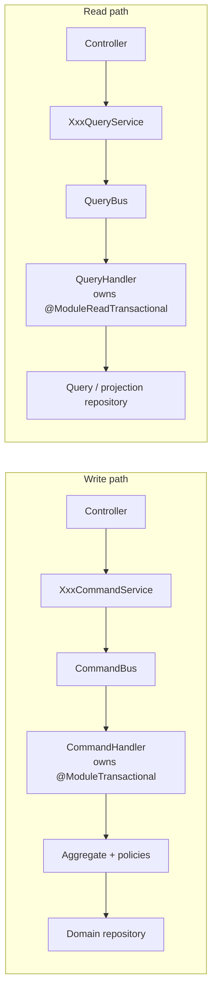
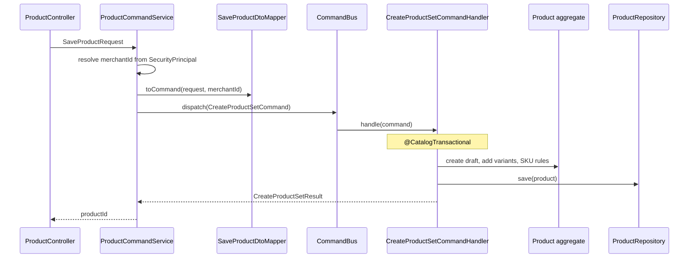
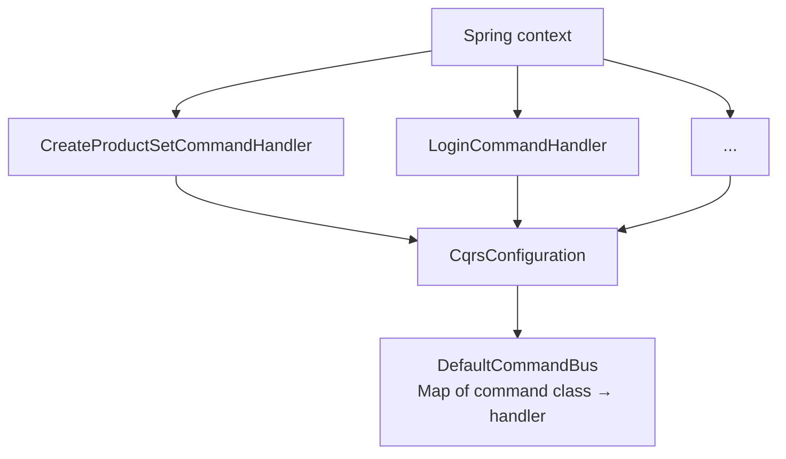

# 2. CQRS (in-process)

**CQRS** here means Command Query Responsibility Segregation **inside one
process**. A **command** changes state. A **query** returns a read model. They
use different handlers, often different repositories, and always different
intent.

There is one `CommandBus` and one `QueryBus` for the whole application. They
are not a message broker. They are in-memory maps from command/query type to
handler.

## Picture

Controllers do not call repositories. Facade services do not contain business
rules. Handlers own the **transaction boundary**.

## Walkthrough: create a product

This is the path `ProductCommandService.saveProduct` takes.

The handler:

1. Loads the `Category` (needed for listing policy).
2. Builds a `Product` aggregate in `DRAFT`.
3. Builds variants (or a default standalone variant).
4. Enforces SKU uniqueness in the domain.
5. Saves through `ProductRepository` — a **port** on the domain, implemented
   in catalog-infrastructure.

The HTTP layer never sees `Product`. It sees a request DTO in and a result /
response DTO out.

### How the bus finds the handler

`CqrsConfiguration` collects every Spring `CommandHandler` bean and passes
them to `DefaultCommandBus`. Each handler reports `getCommandType()`. Duplicate
registrations fail at startup.

Queries work the same way with `QueryHandler` and `DefaultQueryBus`.

## What a query handler is allowed to skip

Listings, search, dashboards, and storefront reads do **not** have to load the
write aggregate.

Example: a product list can use JPQL projections. Inventory can maintain a
**product-variant view** so stock screens do not join the Catalog database.
That view is a read model, updated from Catalog events — see
[Create sellable product](flows/create-sellable-product.md).

Commands still load the full aggregate because that is where invariants live
(status transitions, reservation math, “cannot assign yourself a role”).

## Layer checklist

| Layer | May do | Must not do |
| --- | --- | --- |
| Controller | HTTP mapping, auth principal, HAL links | Business rules, repository access |
| Facade service | DTO ↔ command/query, `bus.dispatch` | Repositories, domain invariants |
| Command handler | Transaction, load/save aggregate, call domain/policy | HTTP types, other module internals |
| Query handler | Transaction (read-only), query repo, map to Result | Mutate aggregates |
| Domain | Invariants, events, ports | Spring, JPA, MapStruct |

## Why this, not the alternative

| Alternative | Why it lost |
| --- | --- |
| **Fat application service** that writes and queries through the same methods | Read DTOs start driving the aggregate shape. Listing filters leak into `Product`. |
| **Axon / EventStore / full CQRS** with a separate read database | Useful when read load or service extraction forces it. Today both sides still read Postgres. An extra product would hide the real lesson (handler + transaction + aggregate). |
| **Queries on the aggregate** (`productRepository.findAll()` then map entities) | You pay aggregate reconstitution for screens that only need a slug, status, and thumbnail. |
| **One handler interface for everything** | The bus would not make intent obvious. Duplicate “update vs get” methods reappear as god classes. |

This is **CQRS-light**: same physical database per module, different models and
code paths. You can later swap the query side to a replica or a dedicated read
store without touching command handlers.

## Where to look in code

| Piece | Location |
| --- | --- |
| Command / query types | `framework/.../cqrs/command`, `framework/.../cqrs/query` |
| Buses | `DefaultCommandBus`, `DefaultQueryBus` |
| Wiring | `store/.../shared/config/CqrsConfiguration.java` |
| Write example | `ProductCommandService` → `CreateProductSetCommandHandler` |
| Read example | any `*QueryService` + `*QueryHandler` under `store/{module}/internal` |

Next: [Module persistence](03-module-persistence.md) — why that `@CatalogTransactional` annotation exists.
