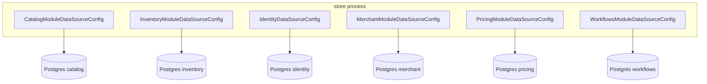
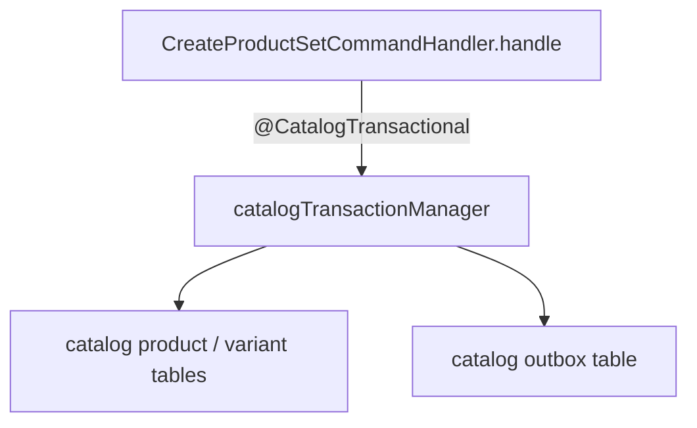

# 3. Module-scoped persistence

Each bounded context has its **own** `DataSource`, `EntityManagerFactory`,
`PlatformTransactionManager`, and Flyway history.

They can all run on one Postgres server. They must not share one implicit
Spring `EntityManager`. That is the line that keeps Catalog from joining
Inventory tables.

## Picture

Dev defaults in `store/.../resources/application-dev.yml` point at
`jdbc:postgresql://localhost:5432/{module}`. Docker Compose injects the same
shape via `CATALOG_DATASOURCE_URL`, `INVENTORY_DATASOURCE_URL`, and so on.

## What each module wires

A module config typically declares:

1. `DataSourceProperties` bound to `{module}.datasource.*`
2. `DataSource`
3. `LocalContainerEntityManagerFactoryBean` scanning **that** infrastructure
   package only (`com.catalog.infrastructure`, …)
4. `JpaTransactionManager` named `{module}TransactionManager`
5. Flyway with `classpath:db/migration/{module}`
6. `@EnableJpaRepositories` pinned to that EMF and TX manager

Catalog’s persistence unit is named `"catalog"`. Repositories in
`catalog-infrastructure` cannot accidentally use the inventory entity manager.

## Explicit transactions — never bare `@Transactional`

With several transaction managers, `@Transactional` with no qualifier is
ambiguous. Spring may pick the wrong manager. Module code therefore uses
composed annotations:

| Annotation | Binds to | Used on |
| --- | --- | --- |
| `@CatalogTransactional` | `catalogTransactionManager` | Command handlers (writes) |
| `@CatalogReadTransactional` | same manager, `readOnly = true` | Query handlers |
| `@InventoryTransactional` / `Read` | inventory | Inventory handlers |
| `@IdentityTransactional` | identity | Identity handlers |
| `@WorkflowsTransactional` | workflows | Process manager |

`CreateProductSetCommandHandler.handle` is annotated `@CatalogTransactional`.
That is the write transaction that covers both the product rows **and** the
catalog outbox rows (see [Outbox](04-outbox.md)).

If this handler used a bare `@Transactional`, a mis-wired default manager
could commit Catalog aggregates without the outbox, or try to write Catalog
entities through the wrong persistence unit.

## Flyway and schema ownership

Migrations live **with the module**, not in a global `db/migration` dump:

- `classpath:db/migration/catalog`
- `classpath:db/migration/inventory`
- … same for identity, merchant, pricing, workflows

Catalog Flyway currently runs when `catalog.seed.enabled` is true (default).
Other modules follow the same idea: the module owns its schema history.

## Why this, not the alternative

| Alternative | Why it lost |
| --- | --- |
| **One datasource for the whole app** | Convenient. Also the fastest way to write `JOIN catalog.product p ON inventory.item.sku`. Boundaries become comments. |
| **Schemas on one datasource** (`catalog.*` vs `inventory.*`) | Better naming, same transaction manager temptation. A single EMF still makes cross-schema joins easy. |
| **Microservices with separate DBs immediately** | You get isolation, plus distributed transactions you are not ready to operate. This design gets the isolation first. |
| **Bare `@Transactional`** | Works in a single-manager app. Here it is a silent bug. |

What you pay: more beans, more property prefixes, no JPA query that spans
modules. Cross-module data is copied as **IDs**, **events**, or **local read
models** (Identity’s `MerchantView` is a projection, not a join to Merchant).

## Extraction path

When a module becomes a service, it takes:

- `{name}-domain`
- `{name}-infrastructure`
- its database
- its Flyway
- its outbox table and processor

`store` would call it over HTTP or a broker instead of an in-process bus.
The persistence design does not have to be invented at that moment.

## Where to look in code

| Piece | Location |
| --- | --- |
| Catalog wiring | `store/.../catalog/internal/config/CatalogModuleDataSourceConfig.java` |
| Write TX | `CatalogTransactional.java` |
| Read TX | `CatalogReadTransactional.java` |
| Dev URLs | `store/src/main/resources/application-dev.yml` |
| Docker | `docker-compose.yml` (`MODULE_DATABASES`, per-module `*_DATASOURCE_URL`) |

Next: [Transactional outbox](04-outbox.md) — what else is in that same transaction.
