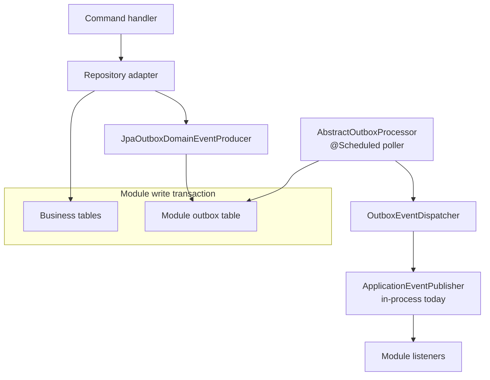
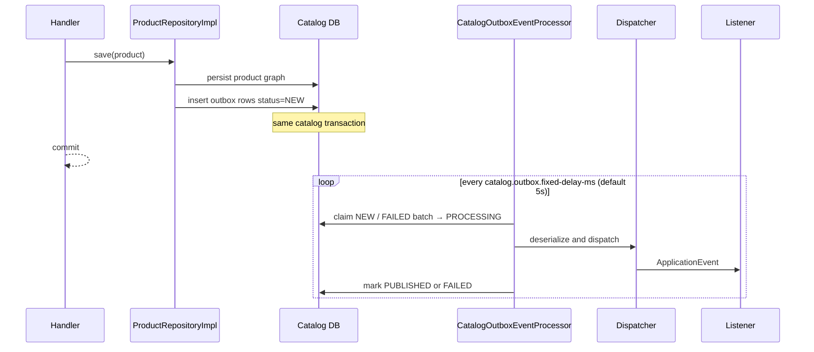

# 4. Module-scoped transactional outbox

When an aggregate changes, it records **domain events** (`Product.pullEvents()`).
Those events must not be published with a second, independent commit. If the
process dies after the product is saved but before listeners run, Inventory
never hears about the new variant.

The **transactional outbox** stores the event rows in the **same database
transaction** as the business write. A later poller publishes them. Delivery
is **at-least-once**. Consumers must be idempotent.

## Picture

Each module has its **own** outbox table and scheduler wrapper
(`CatalogOutboxEventProcessor`, `InventoryOutboxEventProcessor`, …). Shared
mechanics live in `framework/outbox` (contracts) and `outbox-infrastructure`
(JPA store, processor, producer).

## Walkthrough: save a product

`ProductRepositoryImpl.save`:

1. Map the aggregate to JPA and `productJpaRepo.save(entity)`.
2. `product.pullEvents()` — drain events from `AggregateRoot`.
3. `domainEventProducer.produce("Product", id, events)` — insert outbox rows.
4. The surrounding `@CatalogTransactional` commits **both**.

Claim, publish, and cleanup use the module transaction manager. Publish runs
in `REQUIRES_NEW` so a listener failure does not roll back the claim
bookkeeping incorrectly.

Statuses: `NEW` → `PROCESSING` → `PUBLISHED`, or `FAILED` with retry delay.
Published rows are deleted after a retention window.

## At-least-once, not exactly-once

The poller may deliver the same event twice (crash after dispatch, before
marking published). Listeners that update another module must tolerate
duplicates: upsert a projection, or record a processed event id (inbox) if a
retry would double-apply a side effect.

## Why per-module tables, not one shared outbox

| | Shared `outbox_event` | Per-module table (accepted) |
| --- | --- | --- |
| Transaction | Needs one global TX / datasource | Uses the module’s own TX manager |
| Ownership | Platform hotspot | Same owner as the aggregate tables |
| Extraction | Awkward split | Table moves with the service |
| Contention | All modules write one queue | Isolated |
| Day-one simplicity | Easier | More wiring — already paid for datasources |

A shared table would reintroduce the “one persistence center” this repo
removed. See [ADR-002](../system/ADR_002-Module_scoped_outbox_architecture.md)
for the full comparison.

## Why not publish with `ApplicationEventPublisher` in the repository

That is what the code used to do. It is fast and loses events:

- commit succeeds, process dies, listener never ran;
- no retry independent of the request;
- no durable audit of what was published.

The outbox producer **is** the `DomainEventProducer` implementation now.
Repositories still call `produce(...)`; they do not know about JPA outbox
columns.

## Outbox vs workflow events vs SSE

These are three different channels. Do not merge them in your head.

| Channel | Purpose | Durability |
| --- | --- | --- |
| **Module outbox** | Facts about aggregates (`ProductVariantDeletedEvent`) | Durable with the module DB |
| **Workflow request/completion events** | Process manager talking to modules (`RequestCreateProductSetEvent`) | In-process Spring events **today** |
| **SSE to the browser** | UI toast that a saga finished | Best-effort, process-local (designed; see [API chapter](07-api-hateoas-and-sse.md)) |

When a module is extracted, the outbox dispatcher changes from Spring events
to a broker. Serializer should move from Java serialization to JSON/Avro. The
table shape (`event_type`, `event_version`, `payload`, `headers`) is meant to
stay.

## Where to look in code

| Piece | Location |
| --- | --- |
| Aggregate event list | `framework/.../domain/AggregateRoot.java` |
| Port | `framework/.../event/DomainEventProducer.java` |
| Contracts | `framework/.../outbox/*` |
| JPA producer / processor | `outbox-infrastructure/...` |
| Catalog wrapper | `catalog-infrastructure/.../outbox/CatalogOutboxEventProducer.java` |
| Catalog poller | `CatalogOutboxEventProcessor` (`@Scheduled`) |
| Write path | `catalog-infrastructure/.../ProductRepositoryImpl.save` |

Related: [ADR-002](../system/ADR_002-Module_scoped_outbox_architecture.md).

Next: [Orchestration and choreography](05-orchestration-and-choreography.md).
