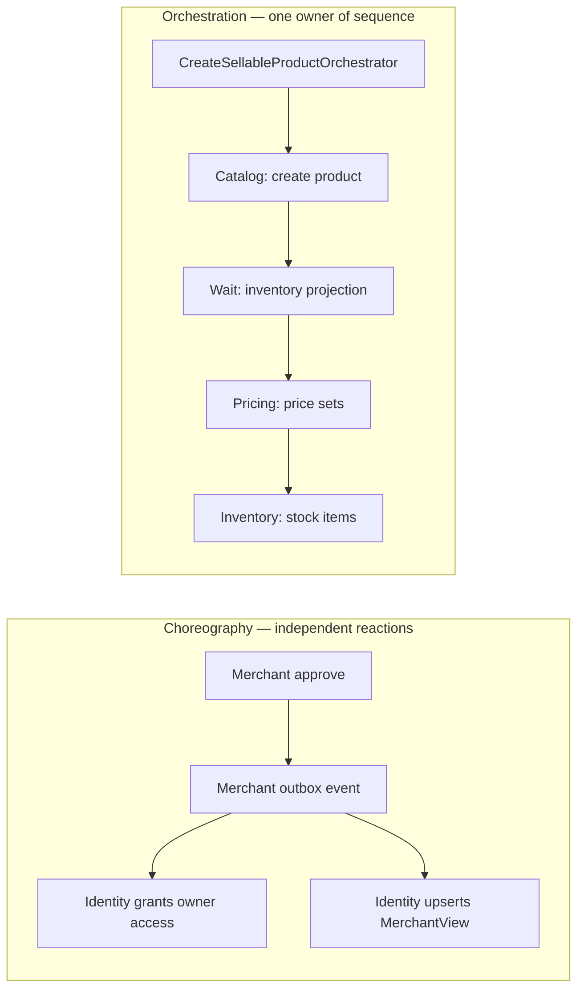
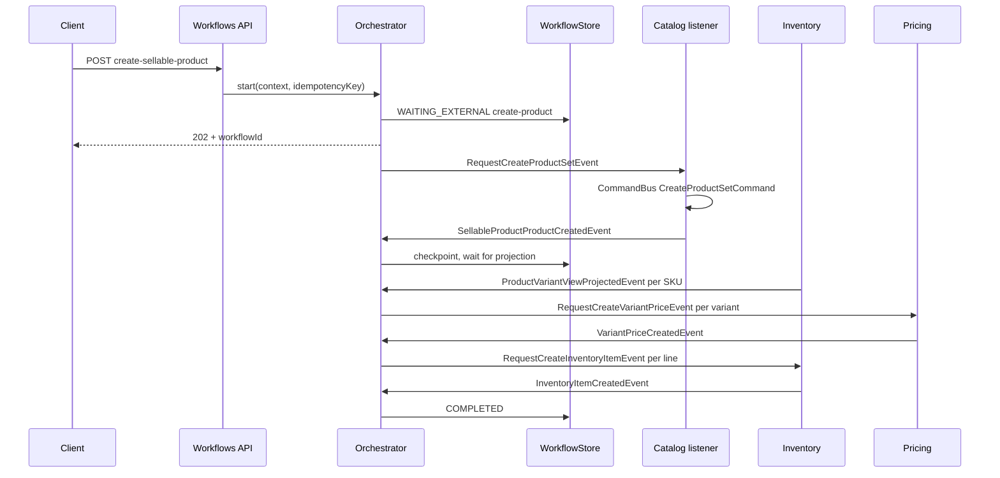
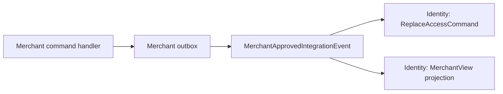
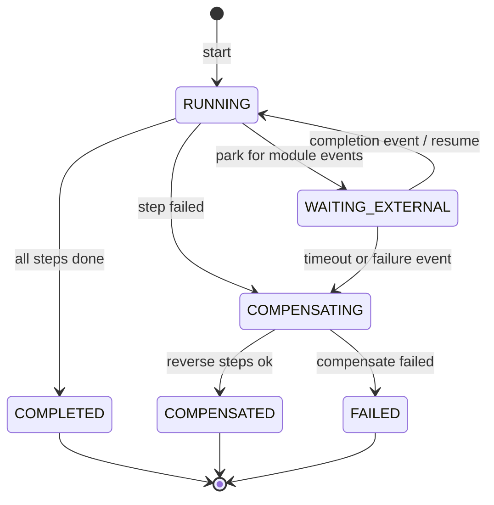

# 5. Orchestration and choreography

A **single-module** write stays in that module’s command handler and
transaction. A **cross-module** write needs a coordination style.

This repo uses two, on purpose:

- **Choreography** — a module publishes a fact; others react. No central
  owner of the sequence.
- **Orchestration (process manager)** — one workflow owns step order,
  checkpoints, waiting, and compensation.

## Picture: choose by ownership

**Rule of thumb:** if you must say “then wait until X, then do Y, and if Z
fails undo Y then X”, you want a process manager. If you only need “when
merchant is approved, Identity should grant access”, that is choreography.

## Why not inject another module’s internals

The discarded pattern: a Catalog workflow step bean called from Inventory,
importing `internal` packages. That:

- breaks Modulith `allowedDependencies`;
- couples transaction managers in one HTTP request;
- makes extraction rewrite the flow, not just the transport.

The replacement: Workflows talks through **named events**
(`store/workflows/events`) or, later, coarse ports. Each module maps those
to its **own** `CommandBus`.

## Orchestration walkthrough: create sellable product

The client calls `POST /api/v1/workflows/create-sellable-product` and gets
**202 Accepted**. The orchestrator parks in `WAITING_EXTERNAL` and publishes
`RequestCreateProductSetEvent`. Catalog handles it with a local command, then
publishes `SellableProductProductCreatedEvent`. The orchestrator checkpoints
and continues.

Fan-in: step 2 waits until **all** expected SKUs are projected; step 3 waits
until **all** prices exist; step 4 waits until **all** inventory items exist.
Failure publishes `SellableProductStepFailedEvent` and the orchestrator
compensates (delete product / price sets) instead of pretending a distributed
rollback exists.

Today those request/completion events are **Spring `ApplicationEventPublisher`
events** (in-process). Aggregate facts inside Catalog/Pricing/Inventory still
go through each module **outbox**. That split is a monolith convenience:
extraction should put the workflow messages on the same durable path.

Worked example: [Create sellable product](flows/create-sellable-product.md).

## Choreography walkthrough: merchant approved

Merchant writes `MerchantAccount` + outbox. After publish, Identity listens
to `MerchantApprovedIntegrationEvent` (named interface `merchant::events`):

- grant owner access via `ReplaceAccessCommand`;
- upsert a local `MerchantView` projection.

Identity does **not** know about Catalog. Catalog does **not** approve
merchants. Worked example: [Merchant onboarding](flows/merchant-onboarding.md).

## Durable workflow kit

The runner is not “hope the HTTP request stays alive”.

Layers:

| Layer | Module | Role |
| --- | --- | --- |
| Types + `DefaultWorkflowRunner` | `framework/.../workflow` | Checkpoint, compensate, resume |
| `JpaWorkflowStore` | `workflow-infrastructure` | `workflow_instance` table |
| Wiring | `store/workflows` | Datasource, Flyway, runner beans |

Create-sellable-product currently drives the instance through
`CreateSellableProductOrchestrator` + `WorkflowStore` directly (event-parked
saga). The generic `WorkflowRunner` is the kit for step-list definitions that
execute in-process with compensate-on-failure. Both persist to the same store
idea: durable status, not only memory.

Resume-from-checkpoint: `RUNNING` / `WAITING_EXTERNAL` can continue; finished
checkpoints are not re-executed. Terminal `FAILED` / `COMPENSATED` cannot be
resumed. Idempotent start uses `idempotencyKey`.

## Why this, not the alternative

| Alternative | Why it lost |
| --- | --- |
| **Always choreography** | Create-product-then-price-then-stock has a required order and compensation. Scattered listeners hide that owner. |
| **Always orchestration** | Merchant approval would force Identity to be a step in a Catalog saga. Identity should react to a **fact**. |
| **One HTTP request, multiple module TXs** | Partial commit with no checkpoint. Crash leaves Catalog written and Pricing missing. |
| **Temporal / Camunda on day one** | Excellent for huge estates. Here the lesson is ports + store + Modulith events. The kit can be replaced later. |

## Where to look in code

| Piece | Location |
| --- | --- |
| Orchestrator | `store/.../createsellableproduct/CreateSellableProductOrchestrator.java` |
| Catalog adapter | `store/.../catalog/internal/event/CreateSellableProductCatalogEventListener.java` |
| Workflow events | `store/.../workflows/events/` (`@NamedInterface("events")`) |
| Runner / store | `framework/.../workflow`, `workflow-infrastructure` |
| Choreography listener | `MerchantAccountApprovedStatusEventListener` |

Related: [ADR-006](../system/ADR_006-Orchestrated_saga_architecture.md),
[ADR-007](../system/ADR_007-Workflow_framework_internal_design.md).
