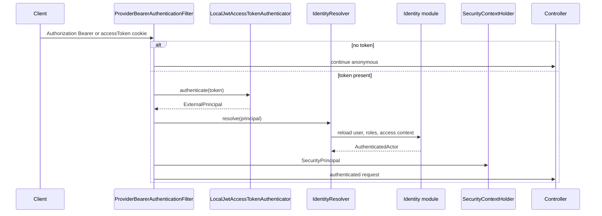
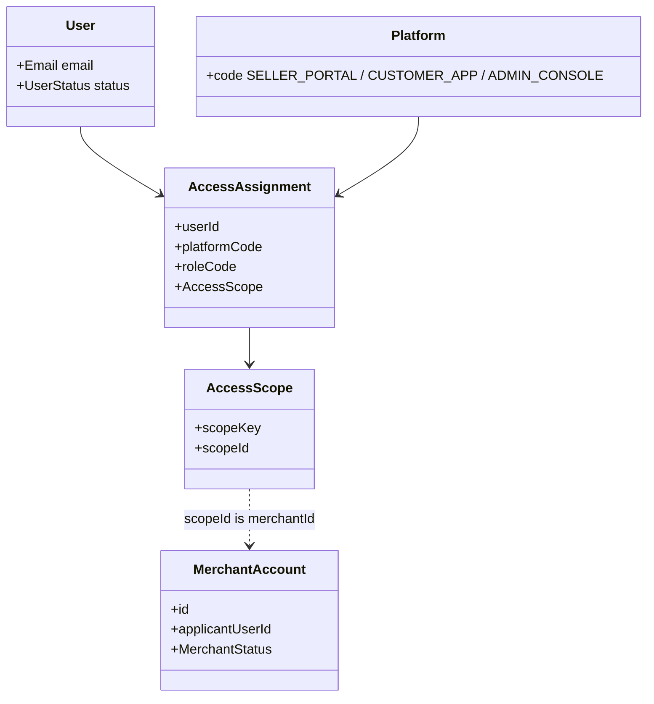

# 6. Security and scopes

Every mutating API must know **who** is acting and **in which context**. That
is not a string the client puts in `X-Actor-Id`. It is a verified token,
resolved into a platform user, wrapped as `SecurityPrincipal`.

Identity owns **users and grants**. Merchant owns **the seller business**.
Catalog still checks that the product’s `merchantId` matches the selected
scope. Those layers stack; they do not replace each other.

## Picture

Token sources: `Authorization: Bearer …`, or the `accessToken` cookie (seller
UI). Malformed Bearer headers fail closed. Failed auth clears cookies and
returns 401 Problem Detail.

## Local JWT today, provider-neutral contracts

Framework types (`AccessTokenAuthenticator`, `ExternalPrincipal`,
`PlatformIdentityResolver`, `AuthenticatedActor`) do not mention JJWT.

The current adapter:

- Identity registers users with BCrypt passwords.
- `LocalTokenLifeCycle` issues short-lived **RSA-signed** access tokens and
  rotating **opaque** refresh tokens (hashes stored in Identity).
- `LocalJwtAccessTokenAuthenticator` checks signature, issuer, audience,
  expiry, token type.
- `IdentityResolver` reloads the user on each request. A suspended user cannot
  ride an unexpired token.

A future OAuth2/OIDC provider replaces **issuance and signature checks**.
Controllers still receive `SecurityPrincipal`. Platform roles still come from
Identity.

## Why a user is not a merchant

One person can shop, own two businesses, staff someone else’s storefront, and
administer the platform. A global `ROLE_SELLER` cannot express that.

- **User** — credentials and account status.
- **Platform** — which application (`SELLER_PORTAL`, …).
- **AccessAssignment** — user + platform role + resource scope.
- **MerchantAccount** — business record in the Merchant BC. Created by
  onboarding, not by registration.

APIs derive merchant id from the principal’s selected access context. Request
bodies are not proof of ownership.

Registering a user does **not** create a merchant, storefront, or warehouse.
See [Merchant onboarding](flows/merchant-onboarding.md).

## Cookies vs Bearer

| | Access token | Refresh token |
| --- | --- | --- |
| Typical browser | HttpOnly cookie `accessToken` | HttpOnly cookie, path limited to refresh |
| Typical API client | `Authorization: Bearer` | refresh endpoint |
| Lifetime | short (`JWT_ACCESS_TOKEN_TTL`, default 15m) | longer (days) |

Cookie flags (`Secure`, `SameSite`) come from env
(`SECURITY_API_COOKIE_*`). This is an **API** cookie model, not session
server-side HTML.

## Why this, not the alternative

| Alternative | Why it lost |
| --- | --- |
| **`X-Actor-Id` trusted header** | Any caller impersonates any user. |
| **Spring `UserDetails` inside every module** | Couples Catalog to Identity’s persistence. |
| **Keycloak/Auth0 required on day one** | Blocks local learning. Contracts already allow swapping the authenticator. |
| **Roles on User only** | Cannot scope “owner of merchant A, staff of merchant B”. |
| **Seller id in JSON as authorization** | Confused authentication with resource selection. |

## Where to look in code

| Piece | Location |
| --- | --- |
| Filter | `store/.../shared/security/filters/ProviderBearerAuthenticationFilter.java` |
| JWT adapter | `LocalJwtAccessTokenAuthenticator`, `LocalTokenLifeCycle` |
| Resolver | `IdentityResolver`, `IdentityResolverClient` |
| Principal | `SecurityPrincipal` |
| Domain | `identity-domain/.../User.java`, `AccessAssignment.java`, `Platform.java` |
| HTTP security | `RootSecurityConfigurer`, `ApiSecurityConfig`, module `*SecurityConfigurer`s |

Related: [ADR-005](../system/ADR_005-Api_security_architecture.md),
[Identity ADR-001](../identity/architecture/ADR_001-Identity-module-architecture.md),
[Identity ADR-003](../identity/architecture/ADR_003-Platform_scopes_architecture.md),
[Identity bounded context](bounded-contexts/identity.md).
