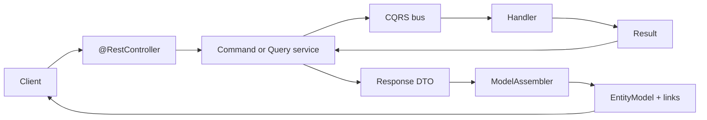
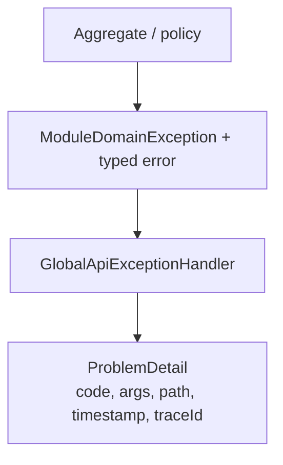

# 7. HTTP API, HATEOAS, errors, and UI push

The store API is JSON over HTTP under `/api/v1/...`. Successful resource
responses are wrapped as Spring HATEOAS `EntityModel` / `PagedModel` (HAL
`_links`). Failures are RFC 7807 **Problem Detail** from a global handler.

## Request shape

Controllers stay thin: validate body, take `@AuthenticationPrincipal
SecurityPrincipal`, call a facade, wrap with an assembler. They do not run
domain rules.

Cross-module links use named interfaces (`catalog::api`, `workflows::api`),
not imports of another module’s `internal` controllers. That is how Inventory
can link to a catalog resource without depending on Catalog internals.

## Why HAL, not RPC-only JSON

Clients (especially a seller shell with several UI fragments) can follow
relation names (`self`, `search-products`, `event-stream`) instead of
concatenating URLs. The payload is still a DTO; links are extra.

This is not GraphQL. Queries stay as HTTP GET + query handlers. You do not
need a graph schema to list locations.

## Errors: typed domain → Problem Detail

Domain and application code throw `DomainException` carrying a sealed
`MessageSource` (`kind`, `code`, `args`). `GlobalApiExceptionHandler` maps
`ErrorCategory` to HTTP status:

| ErrorCategory | HTTP |
| --- | --- |
| `BUSINESS_RULE` | 422 |
| `BAD_REQUEST` | 400 |
| `NOT_FOUND` | 404 |
| `CONFLICT` | 409 |
| `UNAUTHORIZED` | 401 |
| `FORBIDDEN` | 403 |
| `INTERNAL` | 500 |

Codes are stable (`cat.domain....`, `inv.infra....`, `idt.service....`).
Human text can change; clients should key off `code`. Bean validation and
malformed JSON are mapped to shared errors, not ad-hoc strings.

## UI push (SSE) — designed, not in this Java tree yet

[ADR-008](../system/ADR_008-Seller_ui_event_stream.md) specifies one
cookie-authenticated `GET /api/v1/events/stream` owned by `shared`, not by a
domain module. [ADR-009](../system/ADR_009-Workflow_terminal_ui_notifications.md)
would publish a **terminal** workflow envelope (`COMPLETED` / `FAILED` /
`COMPENSATED`) after commit.

There is **no** `SseHub` / `EventStreamController` in this repository’s Java
sources at the time this guide was written. Treat those ADRs as the intended
browser channel, not as running code.

Even when implemented, SSE is **not** the outbox:

| | Outbox | SSE hub |
| --- | --- | --- |
| Audience | Other modules | Seller browser |
| Durability | Module database | Best-effort, process-local |
| Source of truth | Aggregates | REST GET of the workflow/resource |

Polling REST remains correct if the browser was disconnected. Multi-instance
fan-out (Redis / sticky sessions) is a later ops problem.

## Why this, not the alternative

| Alternative | Why it lost |
| --- | --- |
| **OpenAPI-only RPC** (`POST /doCreateProduct`) | Works, but every UI hard-codes paths and misses discoverable flows (workflow 202 + GET status). |
| **GraphQL as the app API** | One graph across BCs encourages leaking Catalog fields into Inventory queries. |
| **HTTP status with a string message only** | No stable `code` for clients; i18n and args disappear. |
| **Exception types that know Servlet** | Domain jars would depend on Spring Web. |
| **Outbox processor writes SSE** | Mixes durable integration with a flaky browser socket. |

## Where to look in code

| Piece | Location |
| --- | --- |
| Assembler example | `store/.../catalog/.../assembler/*ModelAssembler.java` |
| Exception advice | `store/.../shared/exception/GlobalApiExceptionHandler.java` |
| Error categories | `framework/.../exception/ErrorCategory.java` |
| Workflow HTTP | `CreateSellableProductController` (202 + GET by id) |
| Named API packages | `store/.../catalog/api/package-info.java` |

Related: [ADR-003](../system/ADR_003-Exception_handling_framework_architecture.md),
[ADR-008](../system/ADR_008-Seller_ui_event_stream.md),
[ADR-009](../system/ADR_009-Workflow_terminal_ui_notifications.md).
