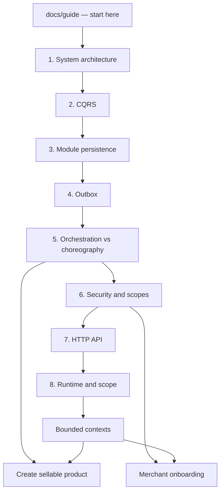

# Technical guide

This is the learning path for the **running** commerce store: a modular
monolith with Domain-Driven Design (DDD) boundaries, in-process CQRS, and
reliable events.

Read this guide to understand **how the system is built and why**. Decision
records (ADRs) stay in `docs/` as the appendix. Product requirements stay in
PRDs. Feature specs stay in `docs/features/`.

If you are new, read in this order. Each chapter assumes the previous one.



| Order | Chapter | What you will be able to explain |
| --- | --- | --- |
| 1 | [System architecture](01-system-architecture.md) | One app, several bounded contexts, how a request is composed |
| 2 | [CQRS](02-cqrs.md) | Why writes and reads take different paths |
| 3 | [Module persistence](03-module-persistence.md) | Why each module has its own database and transaction manager |
| 4 | [Transactional outbox](04-outbox.md) | How domain events survive a crash |
| 5 | [Orchestration and choreography](05-orchestration-and-choreography.md) | When a process manager owns a flow vs when modules just react |
| 6 | [Security and scopes](06-security-and-scopes.md) | JWT, cookies, and why a user is not a merchant |
| 7 | [HTTP API, HATEOAS, and UI push](07-api-hateoas-and-sse.md) | How clients discover links and how errors look |
| 8 | [Runtime and current scope](08-runtime-and-scope.md) | Stack, Docker, and what is **not** built yet |

Then pick a bounded context, then a capstone flow:

- [Catalog](bounded-contexts/catalog.md)
- [Inventory](bounded-contexts/inventory.md)
- [Identity](bounded-contexts/identity.md)
- [Merchant](bounded-contexts/merchant.md)
- [Pricing](bounded-contexts/pricing.md)
- [Workflows](bounded-contexts/workflows.md)
- [Create sellable product](flows/create-sellable-product.md)
- [Merchant onboarding](flows/merchant-onboarding.md)

---

## How to read a chapter

Every chapter follows the same shape:

1. **What this is** — one paragraph.
2. **Picture** — a mermaid diagram of the running design.
3. **Walkthrough** — the path a request or event actually takes.
4. **Why this, not the alternative** — the rejected designs and the cost of each.
5. **Where to look in code** — packages and classes, not theory.

ADRs are linked at the bottom when you want the original decision text.

---

## Glossary

These words are used throughout. They mean the same thing in code and in this
guide.

| Term | Meaning here |
| --- | --- |
| **Bounded context (BC)** | A business area with its own model and language: Catalog, Inventory, Identity, Merchant, Pricing, Workflows. |
| **Modular monolith** | One Spring Boot process (`store`) that still keeps BC code and data isolated. |
| **Aggregate** | A consistency boundary. You load and save the root (for example `Product`). Invariants are enforced there. |
| **Value object** | An immutable domain value with no identity of its own (`Email`, `InventoryQuantity`). |
| **Port** | An interface the domain owns (for example `ProductRepository`). Infrastructure implements it. |
| **CQRS** | Commands change state; queries return read models. Same app, different handlers. |
| **Outbox** | A table in the **same** module transaction as the aggregate write. A poller publishes later. |
| **Choreography** | Module A publishes a fact. Module B reacts. No central owner of the sequence. |
| **Orchestration / process manager** | One workflow owns step order, checkpoints, and compensation. |
| **Named interface** | A public Modulith package (`::events`, `::api`) that other modules may import. `internal/` is private. |
| **Access context** | The selected platform + resource scope on the authenticated principal (for example seller portal + this merchant). |
| **HATEOAS / HAL** | Responses carry `_links` so clients follow relations instead of hard-coding every URL. |

---

## Maven modules at a glance

```
framework/                  shared kernel (CQRS, outbox contracts, workflow types, Id)
logger-slf4j/               SLF4J adapter for the logging SPI
outbox-infrastructure/      reusable JPA outbox store and processor
workflow-infrastructure/    durable workflow instance store
{name}-domain/              pure domain for one BC (no Spring, no JPA)
{name}-infrastructure/      JPA entities, repositories, outbox wrappers
store/                      composition root: HTTP, security, CQRS handlers, wiring
```

`{name}` is currently `catalog`, `inventory`, `identity`, `merchant`, or
`pricing`.

---

## What this guide is not

- It is not the [Commerce Platform PRD](../Commerce_Platform.md). That document
  describes a larger product (cart, checkout, orders, fees, C2C deals) that is
  **not** in this codebase yet.
- It is not a substitute for ADRs. If a chapter and an ADR disagree, trust the
  **code**, then fix the docs. Known stale notes are listed in
  [Runtime and current scope](08-runtime-and-scope.md).
