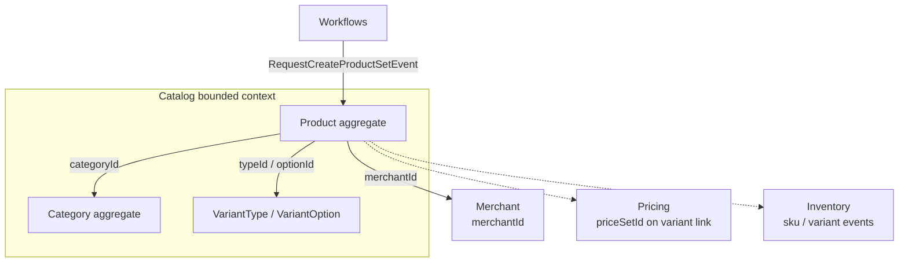
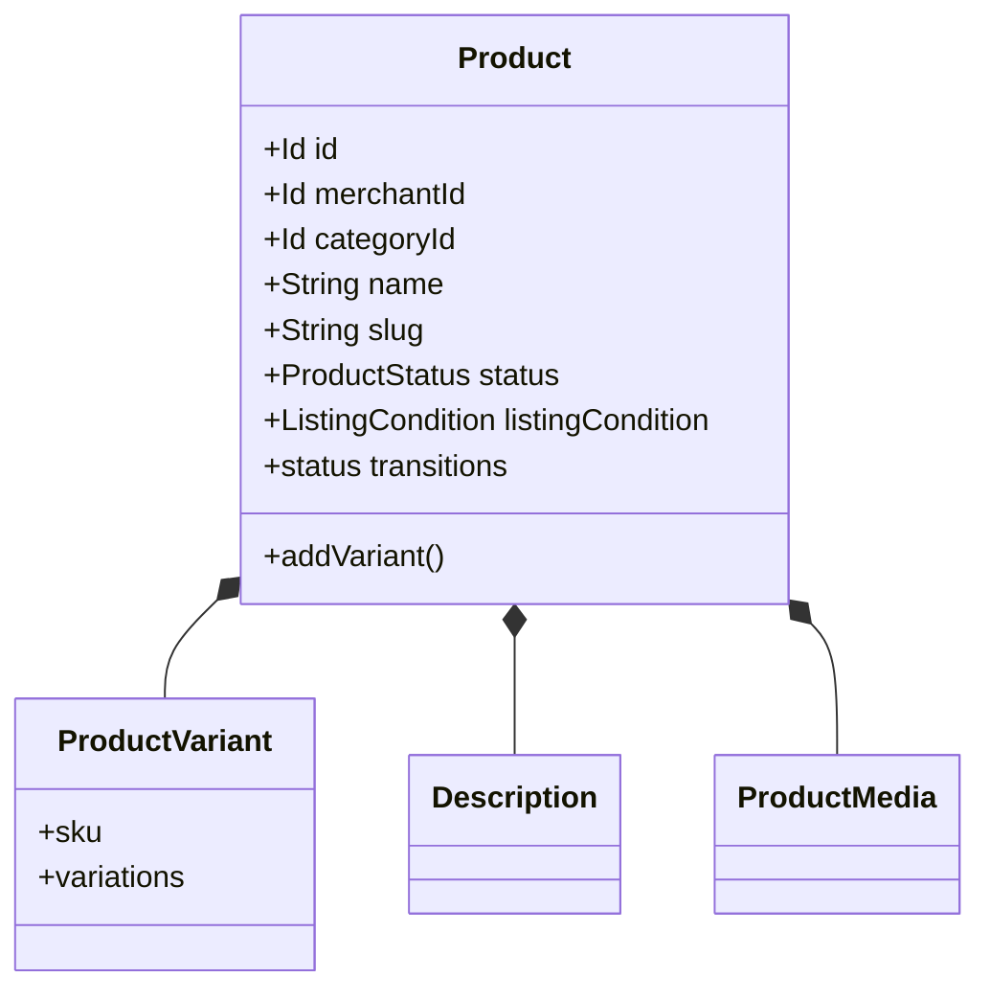
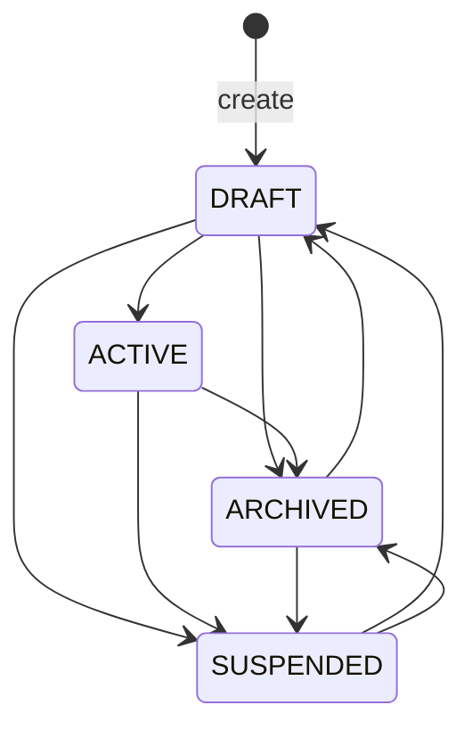

# Catalog bounded context

Catalog owns **what can be sold as content**: products, variants, media,
descriptions, and the category tree. It does not own price or stock.

Other modules reference Catalog by **id** (`productId`, `variantId`, `sku`,
`categoryId`) and by **events**.

## Context map

## Product aggregate

`Product` is the consistency boundary for variants, descriptions, and media.
You do not update a variant as its own aggregate from outside; you go through
the product.

Standalone products without explicit variants still get a **default synthetic
variant** so Pricing and Inventory always hang off a SKU.

Statuses in **code** (`ProductStatus`):

SKU uniqueness and variation-combination uniqueness are domain rules
(specification / policy in handlers + aggregate), not only a unique index
hope.

Products reference **category by id**. They do not navigate the nested-set
tree inside the aggregate.

## Category tree (nested set)

Category is its own aggregate. Hierarchy (move, subtree queries, leaf
detection) is stored with a **nested set** model in infrastructure
(`CategoryNodeInserter`, nested-set library). The domain still speaks
parent/child rules; the table stores left/right bounds for cheap ancestor
queries.

Why nested set rather than naive `parent_id` adjacency only: category admin
needs subtree fetches and reordering without recursive SQL on every request.
Adjacency list is simpler to write and painful to query as a tree.

## Application shape

Same as every BC: REST → facade → CommandBus / QueryBus → handler →
`ProductRepository` / query repo. Writes use `@CatalogTransactional`. Events
leave through the **catalog outbox**.

Named interfaces:

- `catalog::events` — other modules (Inventory, Pricing) may listen
- `catalog::api` — HATEOAS link facades, not internals

Modulith: Catalog may depend on `shared`, `workflows::events`, `workflows::api`.

## Why Catalog does not own price or stock

| If Catalog stored… | What breaks |
| --- | --- |
| Amounts on `Product` | Campaigns, tax-inclusivity, and non-product prices have nowhere honest to live. Pricing’s `calculatePrices` becomes a lie. |
| On-hand quantity | Reservation and movements belong with location topology. Catalog would duplicate Inventory invariants. |

The [create sellable product](../flows/create-sellable-product.md) flow is the
proof: Catalog creates the product set; Pricing and Inventory follow as
separate steps.

## Where to look

| Piece | Location |
| --- | --- |
| Product | `catalog-domain/.../aggregate/Product.java` |
| Status | `catalog-domain/.../valueobject/ProductStatus.java` |
| Nested set | `catalog-infrastructure/.../adapter/category/` |
| Handler | `store/.../catalog/internal/command/handler/CreateProductSetCommandHandler.java` |

Deeper ADRs: [Product](../../catalog/architecture/ADR_002-Product_bounded_context_architecture.md),
[Category](../../catalog/architecture/ADR_001-Category_bounded_context_architecture.md).
Prefer **code** if those ADRs mention `IN_REVIEW` or direct
`ApplicationEventPublisher` after save.
