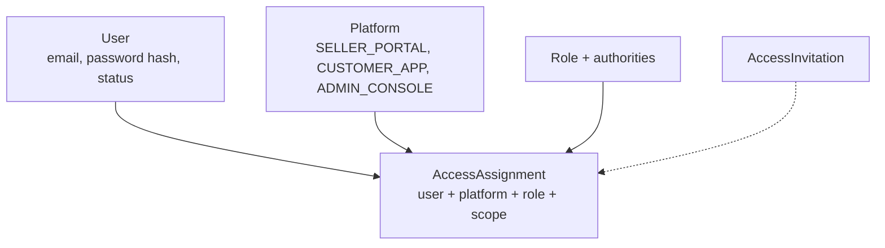
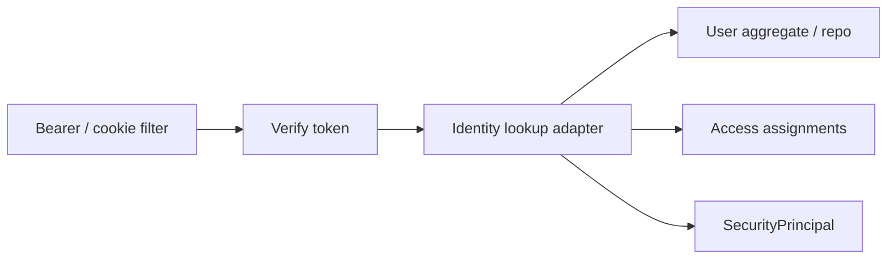

# Identity bounded context

Identity owns **who can sign in and what they may do**: users, credentials,
sessions, platforms, roles, access assignments, invitations.

It does not own merchant legal name, product catalog, or warehouses. When it
needs to display a merchant name, it stores a **MerchantView** projection
updated from Merchant events.

## Aggregates

`User.createLocal` registers with a hashed password and emits
`UserRegisteredEvent`. Status changes (suspend, reactivate) are aggregate
methods — the security filter reloads the user so a revoked account cannot
keep using a valid JWT.

`AccessAssignment.create` refuses assigning yourself
(`selfAssignmentForbidden`) and checks that the role is supported on that
platform.

## How it sits next to security

The HTTP filter lives in `store/shared/security` (composition root). Identity
**module** provides the lookup: load user, compute authorities for the
selected access context, reject inactive accounts.

Details: [Security and scopes](../06-security-and-scopes.md).

## Choreography with Merchant

Identity listens to `merchant::events`:

- `MerchantAccountApprovedStatusEventListener` → `ReplaceAccessCommand` so the
  applicant becomes owner in the seller portal scoped to that `merchantId`.
- `MerchantViewProjectionEventListener` → local read model for names/status.

Identity never calls Merchant repositories.

## Why Identity is a BC, not Spring Security tables only

Spring Security authenticates a request. The **platform** still needs:

- durable users and refresh sessions
- multi-platform, multi-merchant grants
- invitations
- a path to OIDC without rewriting Catalog handlers

That model is domain, persisted in the **identity** database, with its own
outbox.

## Where to look

| Piece | Location |
| --- | --- |
| User | `identity-domain/.../aggregate/User.java` |
| Access | `identity-domain/.../aggregate/AccessAssignment.java` |
| Handlers | `store/.../identity/internal/command/handler/` |
| Merchant reactions | `store/.../identity/internal/event/` |

Related: Identity ADRs under [docs/identity/architecture](../../identity/architecture/).
