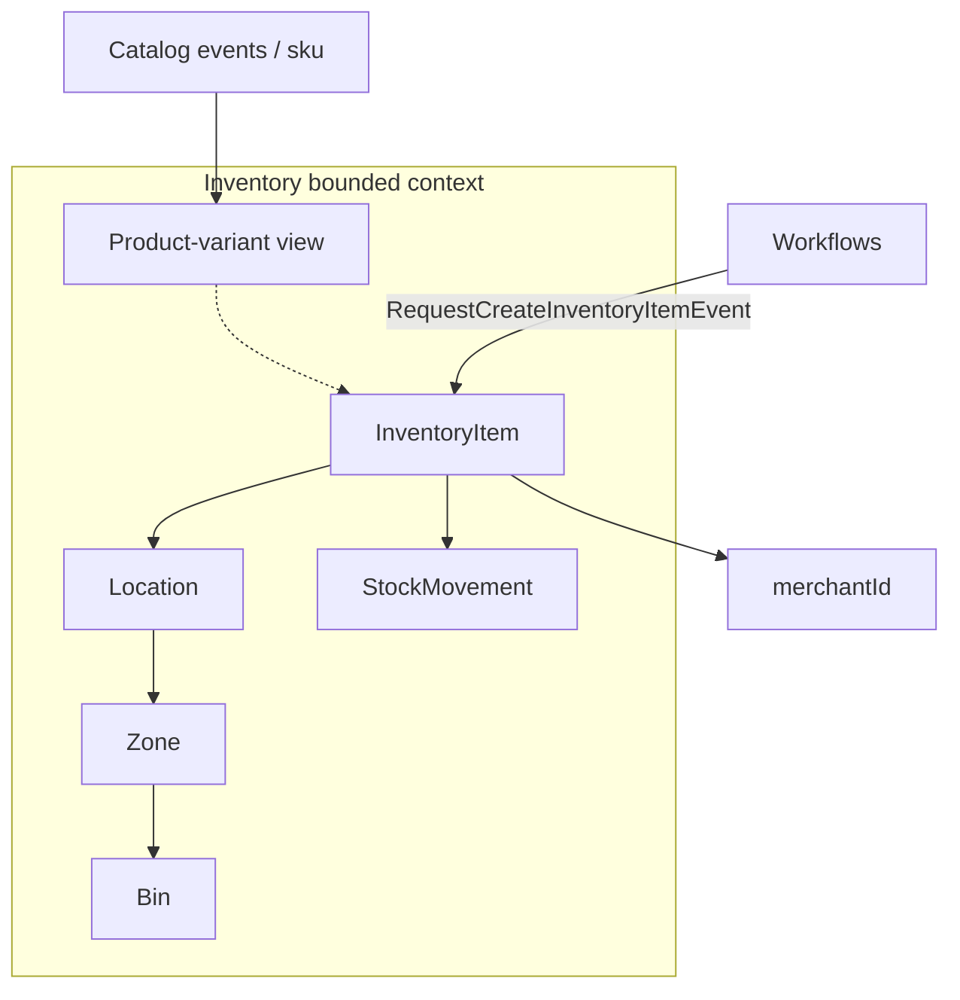
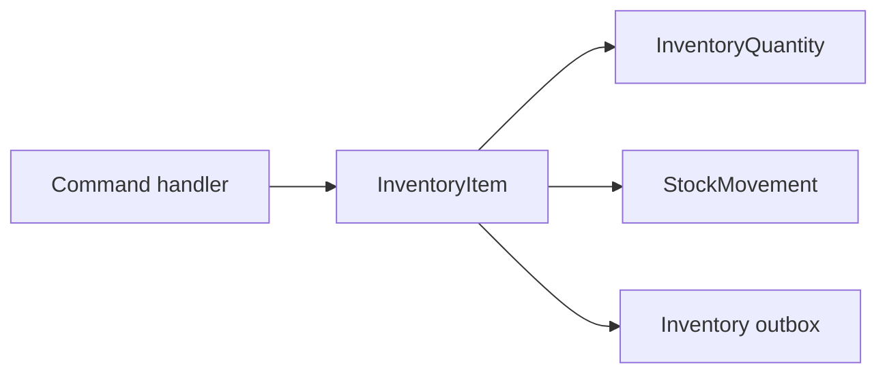

# Inventory bounded context

Inventory owns **physical topology and stock**: locations, zones, bins,
`InventoryItem`, append-only stock movements, reservation/allocation.

It does not own product titles or selling price. It may keep a **local
product-variant view** (projection) so it can create stock lines without
calling Catalog’s database.

## Context map

## InventoryItem aggregate

One item is stock of a SKU for a merchant at a **location**. Quantity is a
value object with non-negative buckets:

- `onHand`
- `reserved`
- `inTransit`
- `damaged`

Mutations (receive, reserve, ship, adjust, mark damaged, discontinue) go
through the aggregate so you cannot reserve more than available. Many
mutations also produce a `StockMovement` — an **append-only** audit record
(corrections are compensating movements, not edits).

`seller` in older docs is `merchantId` in code.

## Location topology

`Location` is a first-class aggregate (warehouse / store / DC). Zones and bins
nest under it. Creating an `InventoryItem` should target an **active**
location — application handlers validate that rather than trusting a random
UUID.

This is not a Merchant **storefront** and not an Identity **platform**. A
storefront is a sales presence; a location is where units sit.

## Why movements are immutable

A mutable “last quantity” column without a ledger cannot answer “why did
on-hand drop?” or support cycle counts. High-volume ops still need one
aggregate for **current** quantity (to serialize reservations) plus a log of
movements.

## Read models

List/search endpoints use query repositories. The product-variant view is how
create-sellable-product **waits** until Catalog’s SKUs exist in Inventory
before creating stock lines — choreography into a projection, then the
orchestrator continues. See [create sellable product](../flows/create-sellable-product.md).

## Modulith

Inventory may depend on `shared`, `catalog::events`, `catalog::api`,
`workflows::events`. It must not import Catalog `internal` packages.

## Where to look

| Piece | Location |
| --- | --- |
| Item | `inventory-domain/.../aggregate/InventoryItem.java` |
| Quantity | `inventory-domain/.../valueobject/InventoryQuantity.java` |
| Location / Zone / Bin | `inventory-domain/.../aggregate/` |
| Store API | `store/.../inventory/internal/api/rest/controller/` |

Related: [ADR inventory domain](../../inventory/architecture/ADR-001_inventory-domain-design.md),
[location design](../../inventory/architecture/ADR-002_inventory-location-design.md),
[inventory-owned products](../../inventory/architecture/ADR_003-Inventory-owned-products.md).
