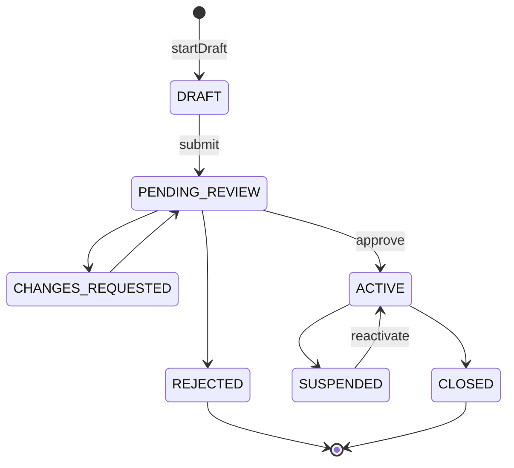
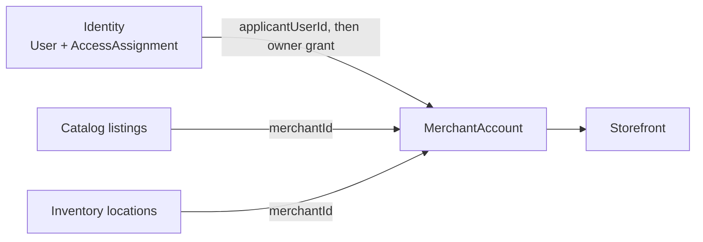

# Merchant bounded context

Merchant owns the **seller business**: `MerchantAccount` lifecycle and
optional **Storefront**. It is not a login, not a role, and not a warehouse.

Identity decides **who may act**. Merchant decides **whether that business
exists and in what status**. Catalog still stores `merchantId` on products.

## Lifecycle

`REJECTED` and `CLOSED` are terminal. Application states
(`DRAFT`, `PENDING_REVIEW`, `CHANGES_REQUESTED`) are open applications.

Registration **does not** call `startDraft`. The authenticated user starts
onboarding explicitly. Approval publishes events so Identity can replace
applicant access with **owner** access. A storefront is a **separate** use
case. A fulfillment location is created in **Inventory**, never guessed.

## Context map

## Events, not shared transactions

Merchant writes its aggregate and **merchant outbox**. Identity (and later
Catalog/Inventory) react. There is no 2PC across merchant and identity
databases.

Modulith: `MerchantModule` allows `shared` only. Others consume
`merchant::events`.

## Why not fold Merchant into Identity

| Temptation | Problem |
| --- | --- |
| `User` has `sellerApproved` | One user, many businesses; staff vs owner; C2C vs 3P vs retailer types |
| Role `MERCHANT` is the business | Roles are grants. A suspended merchant can still be a shopper. |
| Inventory location is the shop | Warehouses are not customer-facing storefronts |

## Where to look

| Piece | Location |
| --- | --- |
| Aggregate | `merchant-domain/.../aggregate/MerchantAccount.java` |
| Status | `merchant-domain/.../enums/MerchantStatus.java` |
| Integration event | `store/.../merchant/events/MerchantApprovedIntegrationEvent.java` |
| Store API | `store/.../merchant/internal/api/` |

Walkthrough: [Merchant onboarding](../flows/merchant-onboarding.md).

Related: [Merchant module ADR](../../merchant/architecture/ADR_001-Merchant_module_architecture.md),
[bounded context ADR](../../merchant/architecture/ADR_002-Merchant_bounded_context_architecture.md).
