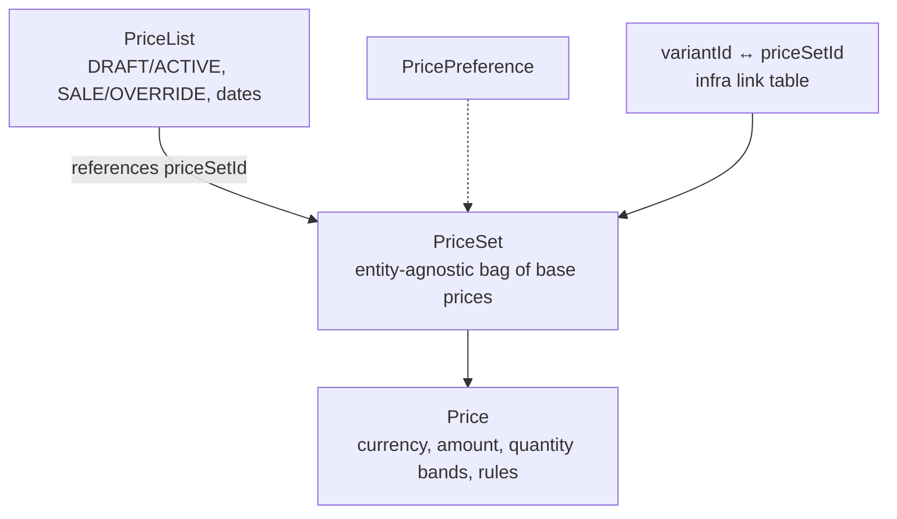
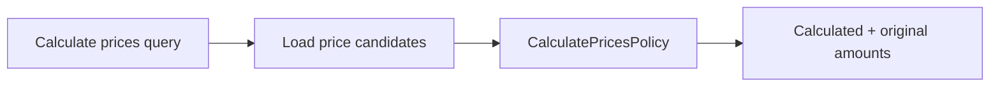

# Pricing bounded context

Pricing owns **amounts and how they are chosen**: `PriceSet` (base prices),
`PriceList` (campaign SALE / OVERRIDE windows), `PricePreference`
(tax-inclusivity etc.), and `CalculatePricesPolicy`.

It does not know product names. Catalog holds an opaque `priceSetId` (via a
Pricing link table for variant ↔ price set). Inventory does not store
currency amounts.

The module can be gated with `pricing.enabled`.

## Aggregates

A `PriceSet` does not contain `variantId`. That keeps shipping or future
entities able to reuse the same engine.

## Calculation

Storefront/checkout (when it exists) and seller tools call a query that loads
candidates and runs `CalculatePricesPolicy.calculate(priceSetIds, context,
candidates, preferences, now)`.

Context typically includes currency, quantity, region, customer group. The
policy filters by currency and quantity, then ranks SALE vs OVERRIDE. Ranking
lives in the **domain policy**, not in the controller.

## Why not columns on Product

| If price lived on Catalog | Cost |
| --- | --- |
| Single `amount` column | No volume tiers, no campaigns, no shared sets |
| Catalog “knows” campaigns | Catalog BC becomes a promotions engine |
| Inventory “sell price” | Stock movements mixed with commercial policy |

Create-sellable-product assigns prices **after** Catalog variants exist and
Inventory has projected SKUs — see [the flow](../flows/create-sellable-product.md).

## Modulith

Pricing may depend on `shared`, `workflows::events`, `catalog::events`.
Persistence: dedicated datasource + outbox, same as other BCs.

## Where to look

| Piece | Location |
| --- | --- |
| PriceSet | `pricing-domain/.../aggregate/PriceSet.java` |
| Policy | `pricing-domain/.../policy/CalculatePricesPolicy.java` |
| Store | `store/.../pricing/` |

Related: [Pricing ADR](../../pricing/architecture/ADR_001-Pricing_module_architecture.md).
