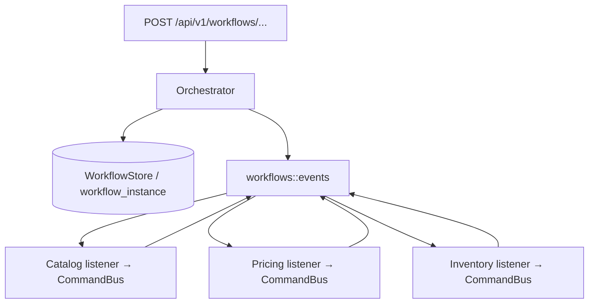

# Workflows bounded context

Workflows owns **process instances**, not product or stock invariants. It
persists status, checkpoints, and correlation ids in the `workflows` database.

Other modules stay behind their own command handlers. Workflows tells them
**what to do next** through named events; they reply with completion or
failure events.

## Place in the monolith

`WorkflowsModule` allows only `shared`. Catalog, Pricing, and Inventory
declare `workflows::events` (and Catalog also `workflows::api` for links).

## Two layers of “workflow”

1. **Framework kit** (`DefaultWorkflowRunner` + `WorkflowStep`) — sequential
   steps, compensate in reverse, resume from checkpoint.
2. **Event-parked sagas** (`CreateSellableProductOrchestrator`) — persist
   `WAITING_EXTERNAL`, publish a request event, continue when completion
   events arrive.

Both need durable state. Neither should import `catalog.internal`.

Protocol explanation: [Orchestration and choreography](../05-orchestration-and-choreography.md).
Capstone: [Create sellable product](../flows/create-sellable-product.md).

## What Workflows must not do

- Enforce SKU uniqueness (Catalog)
- Compute sell price (Pricing)
- Prevent oversell (Inventory)
- Grant roles (Identity)

It may **sequence** those capabilities and **compensate** by asking the owning
module to reverse (delete product, delete price set).

## Where to look

| Piece | Location |
| --- | --- |
| Framework | `framework/.../workflow/` |
| JPA store | `workflow-infrastructure/` |
| Modulith + HTTP | `store/.../workflows/` |
| Events | `store/.../workflows/events/` |

Related: [ADR-006](../../system/ADR_006-Orchestrated_saga_architecture.md),
[ADR-007](../../system/ADR_007-Workflow_framework_internal_design.md).
