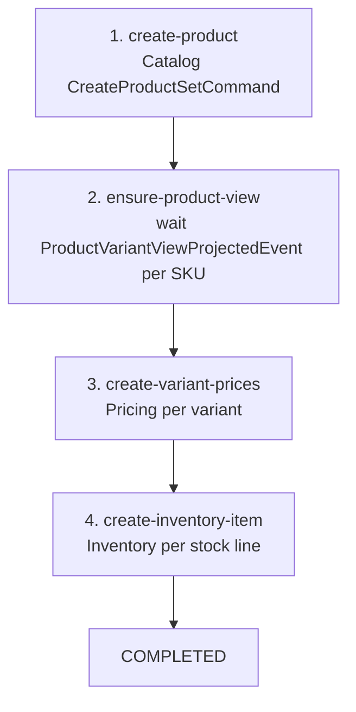
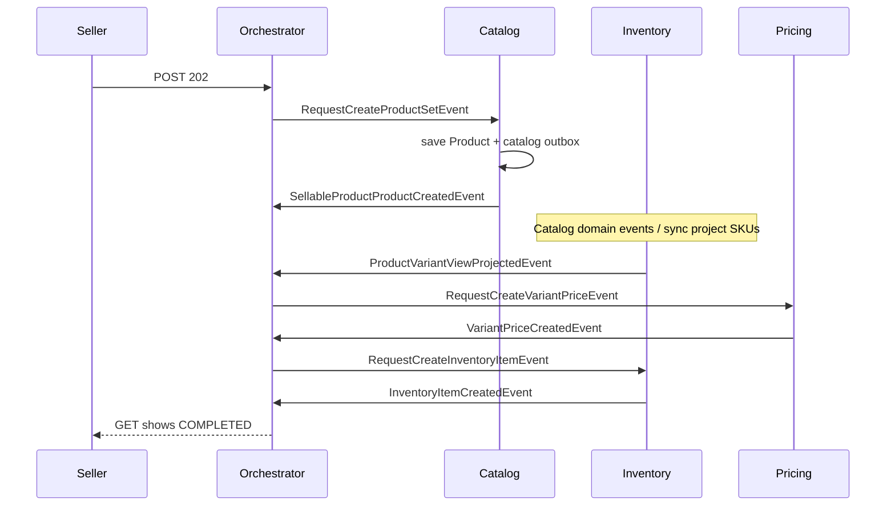
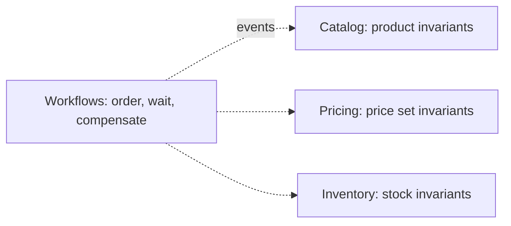

# Flow: create sellable product

**Intent:** create a merchant’s sellable product end-to-end — Catalog product
+ variants, wait until Inventory has projected every SKU, assign variant
prices, then create inventory items.

**Pattern:** process manager (orchestration) with `WAITING_EXTERNAL` and
fan-in. Not a single HTTP transaction across four databases.

**API:** `POST /api/v1/workflows/create-sellable-product` → **202** +
`workflowId`. Poll `GET .../{workflowId}` for status. Seller access comes from
`SecurityPrincipal`, not from a merchant id in the body.

## Why a saga

Catalog, Pricing, and Inventory each have their own database. You cannot
`JOIN` them in one JPA commit. You also cannot “just fire three commands” in
the controller: a crash after Catalog commit would leave a product with no
prices and no stock, and no owner of compensation.

## Step sequence

| Step | Owner | Request event | Done when |
| --- | --- | --- | --- |
| `create-product` | Catalog | `RequestCreateProductSetEvent` | `SellableProductProductCreatedEvent` |
| `ensure-product-view` | Inventory projection | *(none — wait)* | all expected SKUs projected |
| `create-variant-prices` | Pricing | `RequestCreateVariantPriceEvent` × variants | all `VariantPriceCreatedEvent` |
| `create-inventory-item` | Inventory | `RequestCreateInventoryItemEvent` × lines | all `InventoryItemCreatedEvent` |

Failure: `SellableProductStepFailedEvent` → compensate (delete product and/or
price sets). Empty compensate set → `FAILED`.

## Sequence (happy path)

Start is **idempotent** when `idempotencyKey` is sent: the same key returns
the existing instance instead of creating a second product set.

## What stays in each module

The Catalog listener maps the request event to `CreateProductSetCommand` and
dispatches on the **Catalog** bus. It does not save JPA entities itself.

## In-process events vs outbox

Coordination messages (`Request*` / `*Created` / `*Failed`) are Spring
application events **in this monolith**. Aggregate facts inside Catalog still
use the **catalog outbox**. When you extract a service, put the coordination
messages on a durable bus too; do not keep “HTTP 202 + memory-only saga”.

The instance **is** durable (`WorkflowStore`). The messages between steps are
the part that is still process-local.

## Related code and docs

| Piece | Location |
| --- | --- |
| HTTP | `CreateSellableProductController` |
| Saga | `CreateSellableProductOrchestrator` |
| Catalog adapter | `CreateSellableProductCatalogEventListener` |
| Spec | [docs/workflows/create-sellable-product.md](../../workflows/create-sellable-product.md) |
| Update sibling | [docs/workflows/update-sellable-product.md](../../workflows/update-sellable-product.md) |

Protocol: [Orchestration](../05-orchestration-and-choreography.md).
