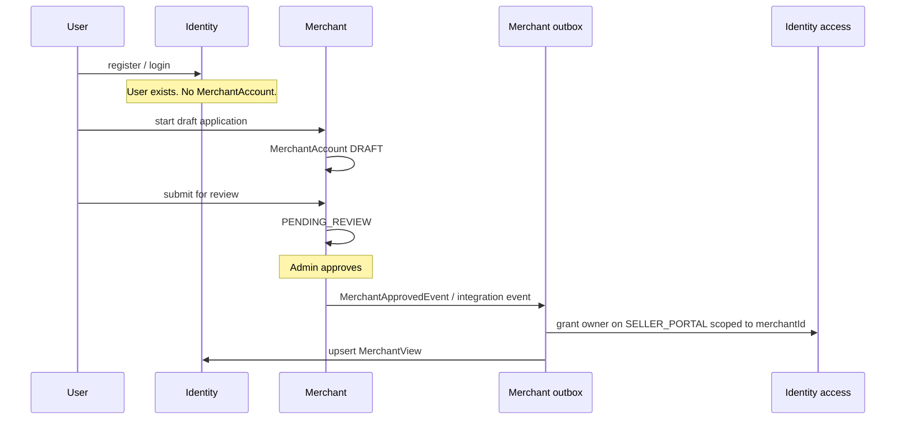
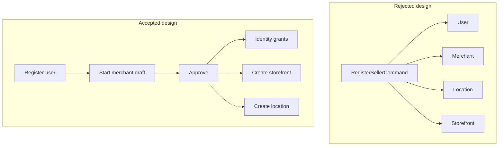

# Flow: merchant onboarding

**Intent:** an authenticated user becomes a seller business, then Identity
grants scoped access. Catalog and Inventory are not created as a side effect.

**Pattern:** **choreography**. Merchant owns the lifecycle. Identity reacts to
facts. There is no process manager stepping Identity.

## Steps a human takes

Storefront creation and Inventory location creation are **later, explicit**
APIs. Approval must not invent a default warehouse.

## Why not one “register as seller” command

A single command that inserts `User` + `MerchantAccount` + `Location` +
`Storefront` would:

- couple four transaction managers;
- create warehouses without addresses;
- mix shopping identity with a business that might be **rejected**;
- make C2C vs retailer vs 3P types a user flag instead of a merchant type.

## Identity’s job after approve

`MerchantApprovedIntegrationEvent` is on `merchant::events` (Modulith named
interface). Identity:

1. `ReplaceAccessCommand` according to `MerchantApprovalAccessPolicy`
   (platform + placement + `scopeId` = merchant id).
2. Projects name/status into `MerchantViewEntity` for local queries.

Identity still enforces its own rules (no self-assignment, platform must
support the role). Merchant still enforces who may approve.

## Trust the principal

After grants exist, seller APIs resolve `merchantId` from
`SecurityPrincipal`’s access context. A JSON field claiming another merchant
is ignored.

## Related

| Piece | Location |
| --- | --- |
| Aggregate | `MerchantAccount.startDraft`, status transitions |
| Event | `MerchantApprovedIntegrationEvent` |
| Listeners | `MerchantAccountApprovedStatusEventListener`, `MerchantViewProjectionEventListener` |

Chapters: [Merchant](../bounded-contexts/merchant.md),
[Identity](../bounded-contexts/identity.md),
[Security](../06-security-and-scopes.md),
[Choreography](../05-orchestration-and-choreography.md).
